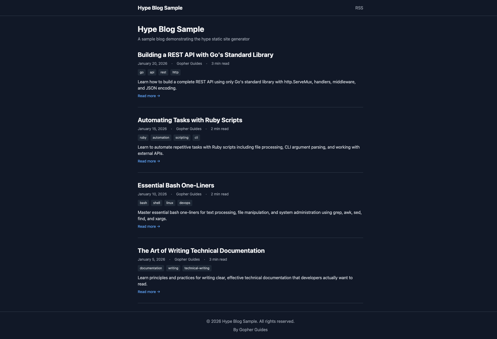
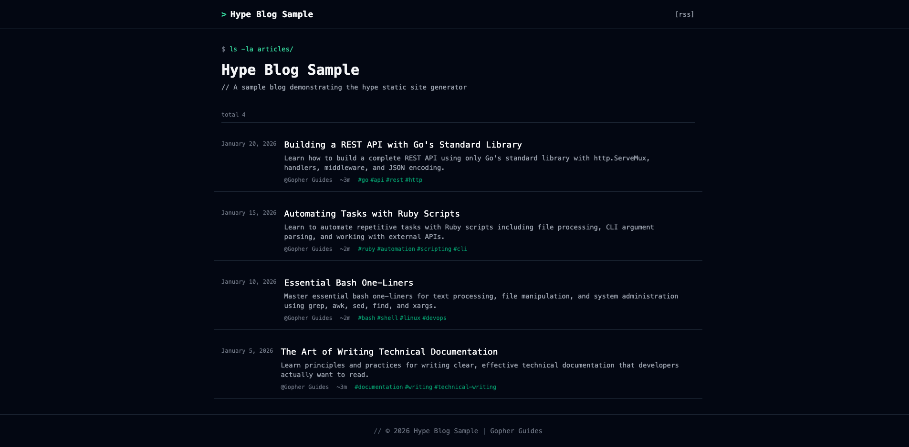
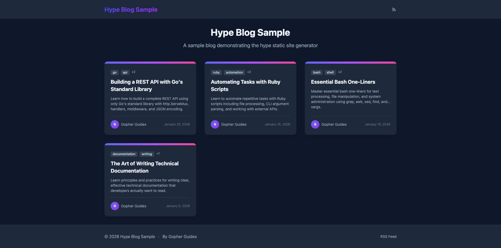

# Blog Generator

<details>
slug: docs/blog
published: 03/15/2026
author: Gopher Guides
seo_description: Hype documentation — Blog Generator. Learn how to use this feature in the Hype dynamic Markdown engine.
tags: docs, blog, hype
</details>


Create beautiful static blogs with hype's signature code execution feature. Write articles in markdown, include runnable code examples, and deploy to GitHub Pages with a single workflow.

**Live Demo:** [gopherguides.github.io/hype-blog-sample](https://gopherguides.github.io/hype-blog-sample)

## Quick Start

```bash
# Install hype
go install github.com/gopherguides/hype/cmd/hype@latest

# Create a new blog
hype blog init mysite
cd mysite

# Create your first article
hype blog new hello-world

# Build and preview
hype blog build
hype blog serve
```

Your site is now live at `http://localhost:3000`.

## Features

- **Code Execution** - Run code blocks and include real output (hype's signature feature)
- **3 Built-in Themes** - suspended (minimal), developer (terminal-style), cards (grid layout)
- **Hugo-style Templates** - Layered template system with easy customization
- **Live Reload** - `--watch` flag for automatic rebuilds during development
- **SEO Ready** - Meta tags, Open Graph, Twitter cards, sitemap, RSS feed
- **GitHub Pages** - Deploy automatically with the included workflow

## Commands

| Command | Description |
|---------|-------------|
| `hype blog init <name>` | Create a new blog project |
| `hype blog new <slug>` | Create a new article |
| `hype blog build` | Build the static site |
| `hype blog serve` | Start local preview server |
| `hype blog serve --watch` | Preview with live reload |
| `hype blog theme list` | List available themes |
| `hype blog theme add <name>` | Add a theme to your project |

## Themes

### Suspended (Default)

Minimal, typography-focused theme perfect for technical writing.



### Developer

Dark, terminal-inspired theme for code-heavy blogs.



### Cards

Modern card-based layout with visual hierarchy.



Switch themes by updating `config.yaml`:

```yaml
theme: "developer"
```

## Deploy to GitHub Pages

Add this workflow to `.github/workflows/deploy.yaml`:

&lt;code src="src/deploy.yaml">&lt;/code&gt;

Then enable GitHub Pages in your repo settings (Settings > Pages > Source: GitHub Actions).

## Project Structure

&lt;code src="src/structure.txt">&lt;/code&gt;

## Article Format

Articles use a `<details>` block for metadata:

```markdown
# My Article Title

<details>
slug: my-article
published: 01/25/2026
author: Your Name
seo_description: Brief description for SEO
tags: go, tutorial
</details>

Your content here...
```

## Full Documentation

For complete documentation including theme customization, template overrides, and advanced features, see [docs/blog/README.md](README.md).
